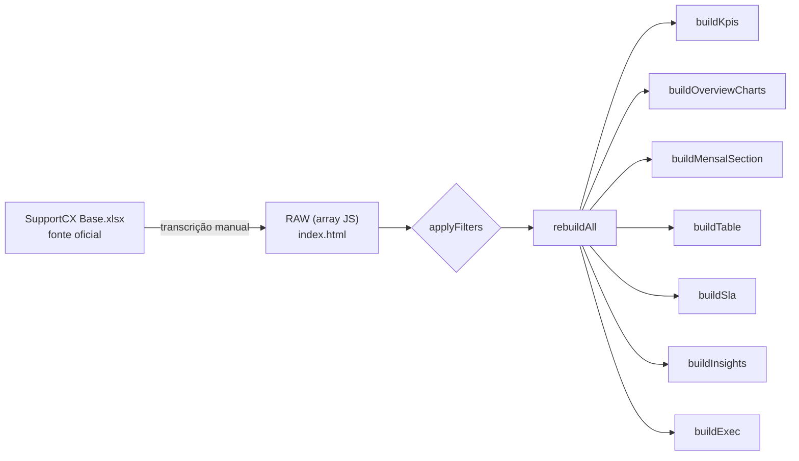

<div align="center">

# Support CX · Dashboard Executivo

**Painel executivo de suporte da Memed** — visão consolidada dos chamados do Jira CX,
sem backend, sem build, sem dependências além de um navegador.

[](index.html)
[](index.html)
[](index.html)
[](https://www.chartjs.org/)
[](index.html)
[](#)

</div>

<p align="center">
  
</p>

<div align="center">

[Visão Geral](#visão-geral) ·
[Por Mês](#seções-do-dashboard) ·
[Cards](#seções-do-dashboard) ·
[SLA & Tempo](#seções-do-dashboard) ·
[Insights](#seções-do-dashboard) ·
[Executivo](#seções-do-dashboard)

</div>

---

## Visão Geral

Este dashboard nasceu de uma pergunta simples: *"como está o suporte este mês?"* —
sem precisar abrir planilha, sem esperar deploy, sem depender de ninguém além de um
arquivo `index.html` aberto direto no navegador.

Os dados vêm da planilha oficial `SupportCX Base.xlsx` (fonte da verdade) e são
transcritos manualmente para um array JavaScript (`RAW`) embutido no próprio HTML.
A partir daí, tudo — KPIs, gráficos, tabelas, filtros — é renderizado no cliente.

> Nenhum dado sai do seu navegador. Nenhum servidor é necessário. Nenhum `npm install`.

## Seções do Dashboard

| Seção | O que você encontra |
|---|---|
| **Visão Geral** | KPIs consolidados e gráficos gerais do período filtrado |
| **Por Mês** | Evolução mês a mês, agrupada por sprint |
| **Cards** | Tabela detalhada de cada chamado, com chips de categoria/status |
| **SLA & Tempo** | Cumprimento de SLA e tempo total de atendimento |
| **Insights** | Padrões, motivos recorrentes e destaques do período |
| **Executivo** | Resumo de alto nível para leitura rápida |

Todas as seções respeitam os mesmos filtros globais: **mês, categoria, status, tipo,
sprint** e as tags **Jira · N3 · Recorrente · Indevido**.

## Como abrir

Não há instalação. Três formas de rodar:

1. **Direto**: dê duplo clique em `index.html`.
2. **Servidor local** (recomendado para evitar bloqueios de `file://` em alguns navegadores):
   ```bash
   python3 -m http.server 8000
   # abra http://localhost:8000
   ```
3. **VS Code**: extensão *Live Server* → botão direito em `index.html` → *Open with Live Server*.

## Como os dados fluem



`RAW` é a única fonte de dados em tempo de execução — todo o resto é derivado dela
pelo pipeline `applyFilters → rebuildAll → build*`.

<details>
<summary><strong>Dicionário de campos do <code>RAW</code></strong> (clique para expandir)</summary>

| Campo | Tipo | Descrição |
|---|---|---|
| `id` | string | Identificador do card no Jira (`CXATEND-XXXX`) |
| `assunto` | string | Título do chamado |
| `categoria` | string | Bug · Usabilidade · Performance · Autenticação · Solicitação · Dúvida |
| `origem` | string | Canal de abertura (ex.: `Jira CX`) |
| `abertura` | ISO date | Data/hora de abertura |
| `primeira_resp` | ISO date | Data/hora da primeira resposta |
| `ultima_resp` | ISO date \| null | Data/hora da última resposta |
| `encerr_jira` | ISO date \| null | Data/hora de encerramento no Jira |
| `sla_h` | number | SLA em horas úteis, calculado na planilha (`HORAS_UTEIS`) — nunca recalculado aqui |
| `tempo_total_h` | number \| null | Tempo total de atendimento em horas |
| `sla_cumprido` | "Sim" \| "Não" | Se o SLA foi cumprido |
| `escalonado_n3` | "Sim" \| "Não" | Se houve escalonamento para N3 |
| `resolvido_se` | "Sim" \| "Não" | Se foi resolvido pelo Suporte |
| `apoio` | string \| null | Time de apoio, quando houve |
| `status` | string | Status atual do card |
| `tipo` | string | Tipo de demanda |
| `motivo` | string | Motivo do contato |
| `severidade` | string | Baixo · Médio · Alto |
| `recorrente` | "Sim" \| "Não" | Se é um problema recorrente |
| `indevido` | "Sim" \| "Não" | Se o chamado foi classificado como indevido |
| `mes` | string | `"YYYY-MM"` |
| `dia` | string | `"YYYY-MM-DD"` |
| `sprint` | string \| null | Sprint correspondente, quando aplicável |
| `tem_jira` | boolean | Se possui card vinculado no Jira |

</details>

## Atualizando os dados

1. Abra `SupportCX Base.xlsx` e confira os cards novos/alterados em cada aba mensal.
2. Atualize o array `RAW` em `index.html` manualmente, mantendo os tipos e convenções
   descritos acima.
3. Valide a sintaxe do array e abra o `index.html` no navegador para conferir as 6 seções,
   filtros e gráficos.
4. Commit no padrão do histórico do projeto: `Atualização DD/MM/AAAA - Support CX`.

## Stack

| Camada | Tecnologia |
|---|---|
| Estrutura | HTML5 puro |
| Estilo | CSS puro (custom properties) |
| Interatividade | JavaScript vanilla |
| Gráficos | [Chart.js 4.4.1](https://www.chartjs.org/) via CDN |
| Fonte | [Outfit](https://fonts.google.com/specimen/Outfit) (Google Fonts) |
| Dados | Array JS hardcoded, fonte: planilha oficial |

Propositalmente **sem** framework, bundler ou gerenciador de pacotes — o projeto é um
único `index.html` distribuído para ser aberto direto no navegador.

---

<div align="center">

Feito para o time de Support CX · Memed

</div>
