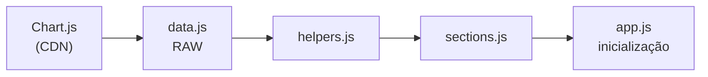
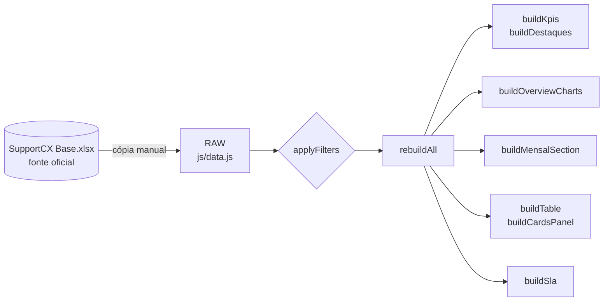
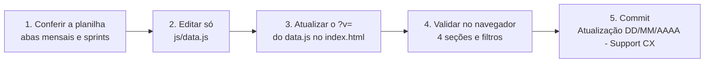

<div align="center">


# Support CX · Dashboard Executivo

**Painel executivo do suporte da Memed.** Visão consolidada dos chamados do Jira CX,
sem backend, sem build e sem instalação.

[](https://chris-cra.github.io/cx-dashboard/)

[](https://github.com/Chris-CRA/cx-dashboard/commits/main)
[](https://github.com/Chris-CRA/cx-dashboard/commits/main)
[](js/)
[](https://www.chartjs.org/)
[](#como-abrir)

[Seções](#seções-do-dashboard) ·
[Como abrir](#como-abrir) ·
[Estrutura](#estrutura-do-projeto) ·
[Fluxo de dados](#como-os-dados-fluem) ·
[Atualizar dados](#atualizando-os-dados) ·
[Regras de SLA](#regras-de-sla)

</div>

---

## Visão geral

O dashboard responde, em poucos segundos, à pergunta *"como está o suporte?"*.
Os dados vêm da planilha oficial **`SupportCX Base.xlsx`** (fonte da verdade) e são
copiados para o array `RAW` em [`js/data.js`](js/data.js). Todo o resto (indicadores,
gráficos, tabelas e filtros) é calculado no navegador a partir desse array.

> [!NOTE]
> Nenhum servidor e nenhum `npm install`. O projeto é publicado no GitHub Pages e também
> abre com duplo clique no `index.html`.

## Seções do dashboard

| Seção | O que mostra |
|---|---|
| **Visão Geral** | Total dos últimos 3 meses, 4 indicadores com variação do último mês fechado, **Destaques do período**, categorias, motivos, status e tipo |
| **Por Mês** | Volume e SLA médio por mês (meses parciais sinalizados) e comparativo mês a mês com seletor de meses |
| **Cards** | Cards por sprint, cards em aberto há mais tempo e tabela completa com busca e ordenação |
| **SLA & Tempo** | Conformidade com a meta de 24h úteis, SLA por faixa, maiores tempos, mediana × média, qualidade e apoio externo |

Todas as seções respeitam os mesmos filtros: **mês, categoria, status, tipo, sprint** e
as tags **Com Jira · N3 · Recorrente · Indevido**.

<details>
<summary><strong>O que mudou na versão executiva (out/2026)</strong></summary>

- Tema escuro mais profundo, texto secundário com contraste acessível (5,7:1) e
  data "Dados até" no cabeçalho.
- Indicadores principais com seta de variação (▲ ▼) do último mês fechado.
- Destaques do período gerados automaticamente a partir dos dados.
- SLA por faixas no lugar de gráficos com dezenas de barras; detalhe card a card
  recolhido em "Ver todos".
- Meta de SLA corrigida para **24 horas úteis**.
- Código separado em HTML, CSS e JS.

</details>

## Como abrir

| Forma | Como |
|---|---|
| **Online** | [chris-cra.github.io/cx-dashboard](https://chris-cra.github.io/cx-dashboard/) |
| **Direto do disco** | Duplo clique em `index.html` |
| **Servidor local** | `python -m http.server 8765` e abrir `http://localhost:8765` |
| **VS Code** | Extensão *Live Server* → botão direito em `index.html` → *Open with Live Server* |

## Estrutura do projeto

```
cx-dashboard/
├── index.html        # estrutura da página
├── css/
│   └── styles.css    # tema (:root) e estilos
├── js/
│   ├── data.js       # const RAW = [...]  ← única coisa que muda nas atualizações de dados
│   ├── helpers.js    # cálculos, formatação, cores, Chart.js, chips
│   ├── sections.js   # renderização de cada seção (build*)
│   └── app.js        # estado, filtros, navegação e inicialização
└── assets/           # logo e favicon
```

Os scripts são clássicos (sem módulos ES) e carregados nesta ordem:


```mermaid
flowchart LR
    CDN["Chart.js<br/>(CDN)"] --> D["data.js<br/>RAW"] --> H["helpers.js"] --> S["sections.js"] --> A["app.js<br/>inicialização"]
```

## Como os dados fluem


```mermaid
flowchart LR
    X[("SupportCX Base.xlsx<br/>fonte oficial")] -->|cópia manual| R["RAW<br/>js/data.js"]
    R --> F{applyFilters}
    F --> RB[rebuildAll]
    RB --> K["buildKpis<br/>buildDestaques"]
    RB --> O[buildOverviewCharts]
    RB --> M[buildMensalSection]
    RB --> T["buildTable<br/>buildCardsPanel"]
    RB --> SL[buildSla]
```

`RAW` é a única fonte de dados em tempo de execução. Tudo o resto é derivado dela pelo
pipeline `applyFilters → rebuildAll → build*`.

<details>
<summary><strong>Dicionário de campos do <code>RAW</code></strong></summary>

| Campo | Tipo | Descrição |
|---|---|---|
| `id` | string | Identificador do card no Jira (`CXATEND-XXXX`) |
| `assunto` | string | Título do chamado |
| `categoria` | string | Usabilidade · Bug · Dúvida · Performance · Autenticação |
| `origem` | string | Canal de abertura (ex.: `Jira CX`) |
| `abertura` | ISO date | Data/hora de abertura |
| `primeira_resp` | ISO date | Data/hora da primeira resposta |
| `ultima_resp` | ISO date \| null | Data/hora da última resposta |
| `encerr_jira` | ISO date \| null | Data/hora de encerramento no Jira |
| `sla_h` | number | Horas úteis até a 1ª resposta, calculadas na planilha (`HORAS_UTEIS`). Nunca recalculado aqui |
| `tempo_total_h` | number \| null | Horas entre abertura e última resposta. `null` enquanto o card está aberto |
| `sla_cumprido` | "Sim" \| "Não" | Se a 1ª resposta saiu dentro de 24h úteis (vem da planilha) |
| `escalonado_n3` | "Sim" \| "Não" | Se houve escalonamento para N3 |
| `resolvido_se` | "Sim" \| "Não" | Se foi resolvido pelo Suporte |
| `apoio` | string \| null | Time de apoio, quando houve |
| `status` | string | Encerrado · Em andamento · Aguardando N3 · Aguardando cliente · Respondido / Aguardando retorno |
| `tipo` | string | Tipo de demanda |
| `motivo` | string | Motivo do contato |
| `severidade` | string | Baixo · Médio · Alto |
| `recorrente` | "Sim" \| "Não" | Se é um problema recorrente |
| `indevido` | "Sim" \| "Não" | Se o chamado foi classificado como indevido |
| `mes` | string | `"YYYY-MM"` (mês da abertura) |
| `dia` | string | `"YYYY-MM-DD"` |
| `sprint` | string \| null | Nome da sprint, igual ao cabeçalho da planilha |
| `tem_jira` | boolean | Se possui card vinculado no Jira |

</details>

## Atualizando os dados


```mermaid
flowchart LR
    A["1. Conferir a planilha<br/>abas mensais e sprints"] --> B["2. Editar só<br/>js/data.js"]
    B --> C["3. Atualizar o ?v=<br/>do data.js no index.html"]
    C --> D["4. Validar no navegador<br/>4 seções e filtros"]
    D --> E["5. Commit<br/>Atualização DD/MM/AAAA - Support CX"]
```

> [!TIP]
> Cards ainda em aberto mantêm o status real, com `ultima_resp`, `encerr_jira` e
> `tempo_total_h` como `null` até existirem na planilha. Quando entra o primeiro card de
> um mês novo, as abas de mês e a Visão Geral passam sozinhas para os 3 meses mais recentes.

> [!IMPORTANT]
> O `?v=` nos links de CSS e JS do `index.html` evita que o GitHub Pages mostre uma versão
> antiga guardada em cache. Sempre que um desses arquivos mudar, atualize o `?v=` dele.

## Regras de SLA

- A meta de 1ª resposta é de **24 horas úteis** (constante `META_SLA_H` em
  [`js/helpers.js`](js/helpers.js)).
- `sla_h` é copiado da planilha, que já desconta fins de semana e os feriados da aba
  `Feriados`. Por isso um card pode ter mais de 4h e ainda assim estar dentro do SLA.
- Se o SLA foi cumprido vem sempre do campo `sla_cumprido`. O dashboard não recalcula.

## Stack

| Camada | Tecnologia |
|---|---|
| Estrutura | HTML5 |
| Estilo | CSS puro com custom properties |
| Interatividade | JavaScript vanilla (scripts clássicos) |
| Gráficos | [Chart.js 4.4.1](https://www.chartjs.org/) via CDN |
| Fonte | [Outfit](https://fonts.google.com/specimen/Outfit) (Google Fonts) |
| Dados | Array JS copiado da planilha oficial |
| Publicação | GitHub Pages |

Sem framework, bundler ou gerenciador de pacotes, de propósito.

---

<div align="center">

Feito para o time de Support CX · Memed

</div>
